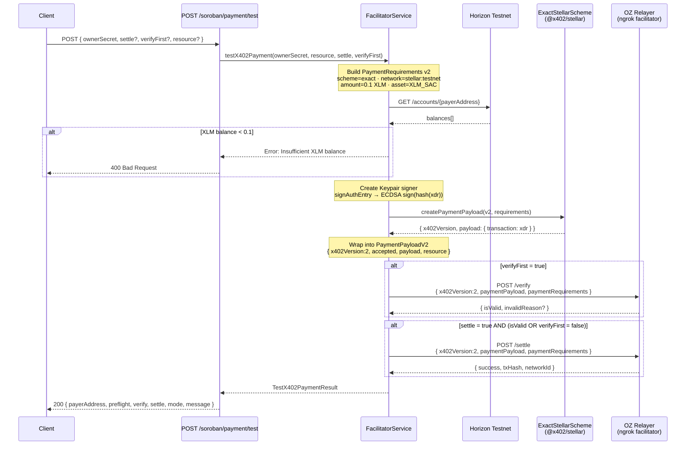
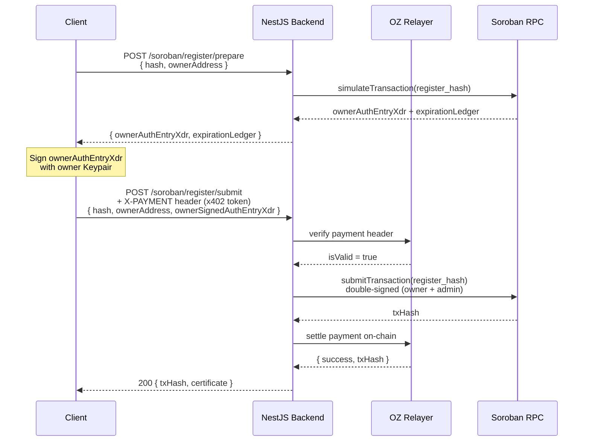

<div align="center">

# 🎵 Nova Registry Agent — Backend

**On-chain musical hash registration on Stellar via Soroban smart contracts + x402 payment protocol**

[](https://nestjs.com)
[](https://www.typescriptlang.org)
[](https://stellar.org)
[](https://soroban.stellar.org)
[](https://x402.org)
[](https://nodejs.org)

</div>

---

## Overview

Nova Registry Agent is a **NestJS** backend that enables musicians and content creators to register the SHA-256 hash of their musical works on the **Stellar blockchain** via a **Soroban smart contract**. Registration is gated by the **x402 payment protocol v2**, enforced through an **OpenZeppelin Relayer** facilitator (OZ Relayer).

### Core Technologies

| Technology | Role |
|---|---|
| **NestJS 11** | REST API framework |
| **Soroban (Stellar)** | Smart contract runtime |
| **x402 Protocol v2** | HTTP-native payment protocol |
| **OZ Relayer** | x402 facilitator (verify + settle) |
| **@nova-registry/sdk-ts** | Local SDK for NovaRegistry |
| **@x402/stellar** | `ExactStellarScheme` payment builder |
| **@stellar/stellar-sdk** | Stellar transaction & auth entry signing |

---

## Architecture

```
Client
  │
  ▼
NestJS Backend (port 3000)
  ├── /assets/*            ← NovaRegistryService (via local SDK)
  └── /soroban/*           ← SorobanService + FacilitatorService
          │
          ├── Soroban RPC  ← https://soroban-testnet.stellar.org
          ├── Horizon      ← https://horizon-testnet.stellar.org
          └── OZ Relayer   ← ngrok facilitator (verify / settle)
```

---

## x402 Payment Test Flow

> `POST /soroban/payment/test` — End-to-end x402 protocol test



---

## Hash Registration Flow

> `POST /soroban/register/submit` — Full x402-gated Soroban registration



---

## Environment Variables

Create a `.env` file at the project root:

```env
# Stellar admin keypair (signs all Soroban transactions as admin)
STELLAR_SECRET=SB5PDHKIYI6DLJOKGMCD67UD2DOEDZL6VN7SWJEAIDJ24WARMFQJQLZ6

# OZ Relayer facilitator base URL (x402 verify + settle)
FACILITATOR_URL=https://your-relayer.ngrok-free.dev/api/v1/plugins/x402/call

# OZ Relayer API key
FACILITATOR_API_KEY=your-api-key-here

# (Optional) Override default port
PORT=3000
```

---

## Setup & Run

```bash
# Install dependencies
npm install

# Development (watch mode)
npm run start:dev

# Development (single run)
npm run start

# Production
npm run build
npm run start:prod
```

Server starts at: `http://localhost:3000`

---

## API Reference

### Assets Endpoints

#### `POST /assets/register`
Register a digital asset hash through the Nova Registry SDK.

**Request Body:**
```json
{
  "contentHash": "sha256-hex-string",
  "title": "My Song",
  "artist": "Artist Name",
  "fileName": "song.mp3",
  "ownerAddress": "G...",
  "metadata": {}
}
```

**Response `200`:**
```json
{
  "requestId": "uuid",
  "status": "pending"
}
```

---

#### `GET /assets/status/:requestId`
Get registration status by requestId.

**Response `200`:**
```json
{
  "requestId": "uuid",
  "status": "completed | pending | failed",
  "certificateId": "..."
}
```

---

#### `GET /assets/certificate/:certificateId`
Get the final registration certificate.

---

#### `GET /assets/check/:contentHash`
Check if a content hash already has a registered certificate.

---

### Soroban Endpoints

#### `GET /soroban/info`
Returns static contract metadata.

**Response `200`:**
```json
{
  "contractId": "CDNBMD3AA6QPW4SR2RSG2BO46X4SFKA6N4GLVDEGCANYTBWX57M7YNLD",
  "network": "testnet",
  "explorerUrl": "https://stellar.expert/explorer/testnet/contract/...",
  "functions": ["initialize", "register_hash", "get_hash_info", "get_hash_count"],
  "payment": {
    "scheme": "exact",
    "network": "stellar:testnet",
    "price": "$0.10",
    "asset": "CBIELTK6...",
    "payTo": "GC6XSCI..."
  }
}
```

---

#### `GET /soroban/facilitator/supported`
Query the OZ Relayer for supported payment kinds.

**Response `200`:**
```json
{
  "kinds": [
    { "scheme": "exact", "network": "stellar:testnet" }
  ]
}
```

---

#### `GET /soroban/count`
Returns total number of registered hashes on the smart contract.

**Response `200`:**
```json
{
  "totalRegistered": 42,
  "contractId": "CDNBMD3..."
}
```

---

#### `GET /soroban/hash/:hash`
Look up a registered hash on-chain.

**Response `200`:**
```json
{
  "hash": "abc123...",
  "owner": "GABC...",
  "timestamp": 1713000000,
  "registeredAt": "2026-04-13T00:00:00.000Z",
  "contractId": "CDNBMD3..."
}
```

**Response `404`:** Hash not registered.

---

#### `POST /soroban/initialize`
Initialize the smart contract (one-time operation, admin only).

**Request Body:**
```json
{
  "adminAddress": "GC6XSCI..."
}
```

**Response `200`:**
```json
{
  "success": true,
  "txHash": "abc123...",
  "message": "Contract initialized successfully"
}
```

---

#### `POST /soroban/register/prepare`
**Phase 1** of the two-signature Soroban registration flow.
Returns the auth entry XDR that the owner must sign.

**Request Body:**
```json
{
  "hash": "sha256-hex",
  "ownerAddress": "GABC..."
}
```

**Response `200`:**
```json
{
  "ownerAuthEntryXdr": "AAAAAQ...",
  "latestLedger": 123456,
  "expirationLedger": 123556,
  "instructions": "Sign ownerAuthEntryXdr with your Stellar keypair and send to POST /soroban/register/submit"
}
```

---

#### `POST /soroban/register/submit`
**Phase 2** — Submit the signed registration (x402 payment-gated).
Requires a valid `X-PAYMENT` header (x402 token) verified by the OZ Relayer middleware.

**Request Body:**
```json
{
  "hash": "sha256-hex",
  "ownerAddress": "GABC...",
  "ownerSignedAuthEntryXdr": "AAAAAQ..."
}
```

**Response `200`:**
```json
{
  "success": true,
  "txHash": "abc123...",
  "explorerUrl": "https://stellar.expert/...",
  "certificate": {
    "hash": "sha256-hex",
    "owner": "GABC...",
    "timestamp": 1713000000,
    "registeredAt": "2026-04-13T00:00:00.000Z"
  }
}
```

---

#### `POST /soroban/register/dev`
Single-step registration for **development/testing only**.
Accepts `ownerSecret` directly — do NOT expose in production.

**Request Body:**
```json
{
  "hash": "sha256-hex",
  "ownerAddress": "GABC...",
  "ownerSecret": "SABC..."
}
```

**Response `200`:**
```json
{
  "success": true,
  "txHash": "abc123...",
  "explorerUrl": "https://stellar.expert/...",
  "certificate": { "hash": "...", "owner": "...", "timestamp": 0, "registeredAt": "..." },
  "_warning": "Endpoint for development/testing use only"
}
```

---

#### `POST /soroban/payment/test`
Direct x402 protocol test. Builds a real Stellar transaction using `ExactStellarScheme` and sends it to the OZ Relayer for verification and optional on-chain settlement.

> ⚠️ Development/testing only — do NOT expose in production.

**Request Body:**
```json
{
  "ownerSecret": "SABC...",
  "settle": false,
  "verifyFirst": true,
  "resource": "/soroban/register/submit"
}
```

| Field | Type | Default | Description |
|---|---|---|---|
| `ownerSecret` | `string` | required | Stellar secret key of the payer (must have XLM) |
| `settle` | `boolean` | `false` | If `true`, settles payment on-chain after verify |
| `verifyFirst` | `boolean` | `true` | If `false`, skips verify and goes directly to settle |
| `resource` | `string` | `/soroban/register/submit` | Protected resource URL |

**Response `200`:**
```json
{
  "payerAddress": "GABC...",
  "paymentRequirements": {
    "scheme": "exact",
    "network": "stellar:testnet",
    "amount": "1000000",
    "asset": "CDLZFC3...",
    "payTo": "GC6XSCI...",
    "maxTimeoutSeconds": 300
  },
  "preflight": {
    "requiredAmount": "0.1000000",
    "xlmBalance": "9999.9000000",
    "isSufficient": true
  },
  "verify": {
    "isValid": true,
    "invalidReason": null
  },
  "settle": {
    "success": true,
    "txHash": "abc123...",
    "networkId": "stellar:testnet"
  },
  "mode": "verify-and-settle",
  "message": "Payment settled on-chain successfully"
}
```

**Response `400`:** Insufficient XLM balance.  
**Response `502`:** Facilitator unreachable or returned an error.

---

## Network & Contract Info

| Item | Value |
|---|---|
| **Network** | Stellar Testnet |
| **Contract ID** | `CDNBMD3AA6QPW4SR2RSG2BO46X4SFKA6N4GLVDEGCANYTBWX57M7YNLD` |
| **Admin Wallet** | `GC6XSCIHDDZYO46E2VKCCFH7SEPGZACWO6YX4ARN7ALVACGAL2NRKIR4` |
| **XLM SAC (testnet)** | `CDLZFC3SYJYDZT7K67VZ75HPJVIEUVNIXF47ZG2FB2RMQQVU2HHGCYSC` |
| **USDC SAC (testnet)** | `CBIELTK6YBZJU5UP2WWQEUCYKLPU6AUNZ2BQ4WWFEIE3USCIHMXQDAMA` |
| **Soroban RPC** | `https://soroban-testnet.stellar.org` |
| **Horizon** | `https://horizon-testnet.stellar.org` |
| **Explorer** | [stellar.expert/testnet](https://stellar.expert/explorer/testnet/contract/CDNBMD3AA6QPW4SR2RSG2BO46X4SFKA6N4GLVDEGCANYTBWX57M7YNLD) |

---

## Testing with PowerShell

```powershell
# Check XLM balance
$a = Invoke-RestMethod "https://horizon-testnet.stellar.org/accounts/YOUR_ADDRESS"
$a.balances | Select-Object asset_type, asset_code, balance

# Test x402 verify only
Invoke-RestMethod -Uri "http://localhost:3000/soroban/payment/test" `
  -Method POST -ContentType "application/json" `
  -Body '{"ownerSecret":"SABC...","settle":false,"verifyFirst":true}'

# Test x402 verify + settle
Invoke-RestMethod -Uri "http://localhost:3000/soroban/payment/test" `
  -Method POST -ContentType "application/json" `
  -Body '{"ownerSecret":"SABC...","settle":true,"verifyFirst":true}'

# Lookup registered hash
Invoke-RestMethod "http://localhost:3000/soroban/hash/YOUR_HASH_HEX"

# Get total registered count
Invoke-RestMethod "http://localhost:3000/soroban/count"
```

---

## Project Structure

```
src/
├── main.ts                          # Bootstrap + x402 paymentMiddleware
├── app.module.ts
├── assets/
│   └── assets.controller.ts         # /assets/* — Nova Registry SDK wrapper
├── nova-registry/
│   ├── nova-registry.module.ts
│   ├── nova-registry.service.ts     # SDK integration (@nova-registry/sdk-ts)
│   └── nova-registry-exception.filter.ts
└── soroban/
    ├── soroban.module.ts
    ├── soroban.controller.ts        # /soroban/* — all REST endpoints
    ├── soroban.service.ts           # Soroban RPC calls (prepare/submit/query)
    ├── soroban.constants.ts         # Contract ID, SAC addresses, payment config
    └── facilitator.service.ts       # x402 facilitator client + payment test
```

---

<div align="center">

Built for **Nova Registry Hackathon** · Stellar Testnet · x402 Protocol v2

</div>
